# Nuqi's Web Portofolio

This is a web portofolio of my friend Nuqi (Ibnu Hafiz Fadhilah) as to help me practice my front-end skill. Artworks and graphics presented are property of his and belong to their respective owner. Here I will try to keep the theme as similar as possible from the original portofolio.

[Click here](nuqiporto.site) or [nuqiporto.site](nuqiporto.site) for the website!

## How to Deploy & Connect Netlify to your Github Project

### 1. Log In or Sign Up to netlify

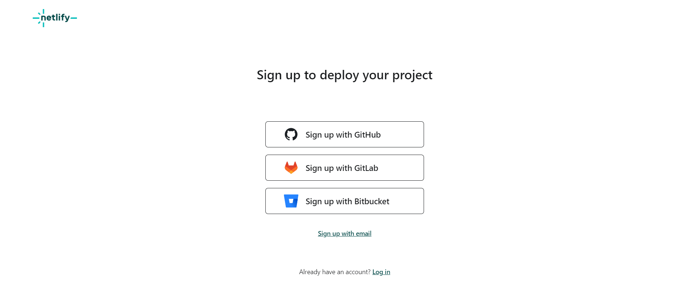

Log in or sign up if you don't have a netlify account

### 2. Add new site

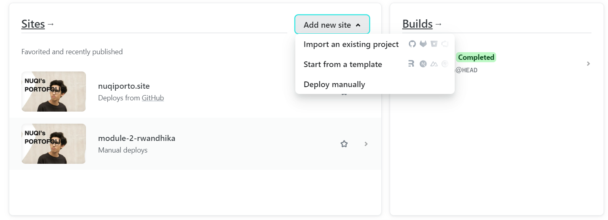

Click add new site and then choose __Import an existing project__

### 3. Deploy with Github

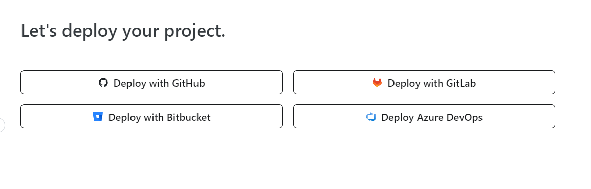

Choose __deploy with Github__, it will then redirect you to authorized your github project to your netlify

### 4. Deploy your project

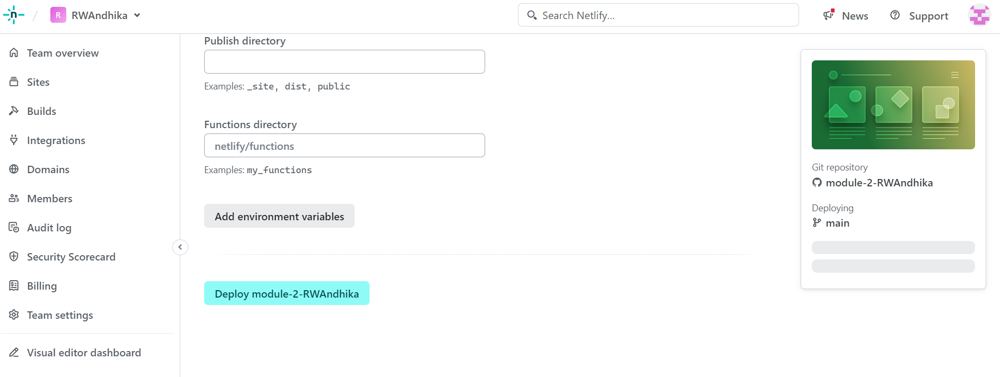

Choose your project that you want to deploy and then click __Deploy <-project name->__. It will then proceed to deploy your project and you can see that the website is being deployed from Github

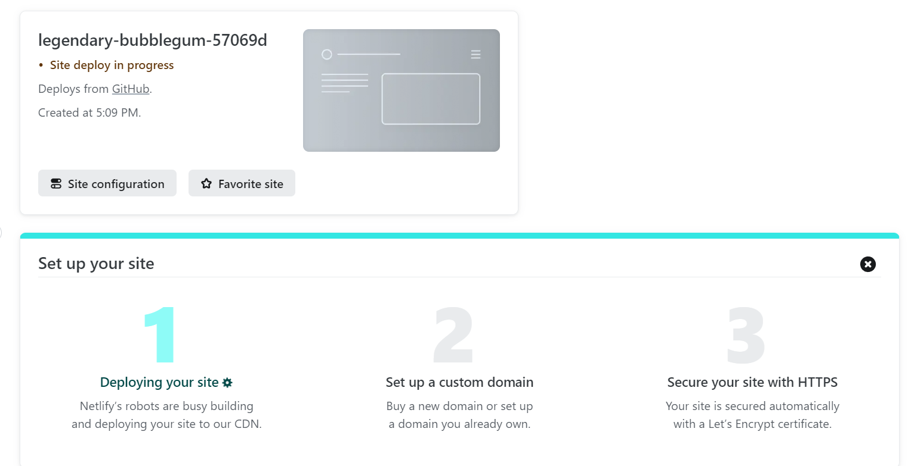

## Buy and Set Up Custom Domain and DNS

### 1. Log in or Sign up to niagahoster

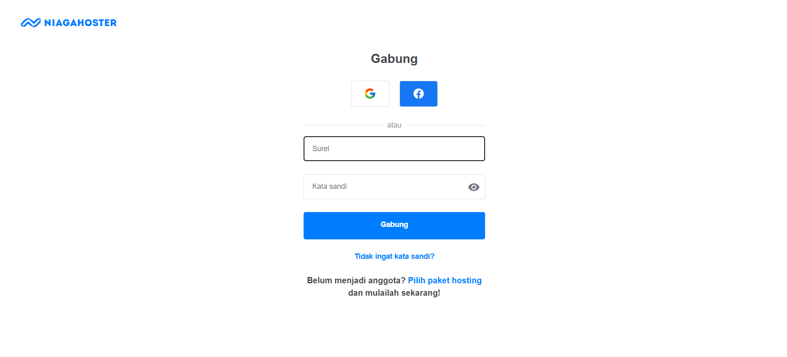

Log in or Sign up to niagahoster if you don't have an account

### 2. Get a New Domain

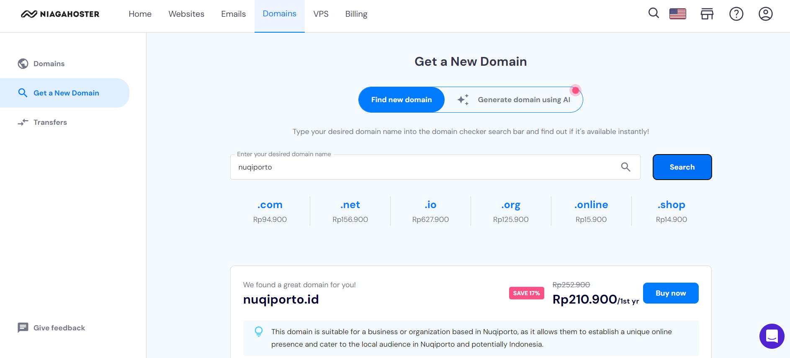

Click on __Domains__ on the menubar and then click __Get a New Domain__. After that, enter your desired domain name. It will show the available domain that you can choose. After that, choose __buy domain__ that you want to use

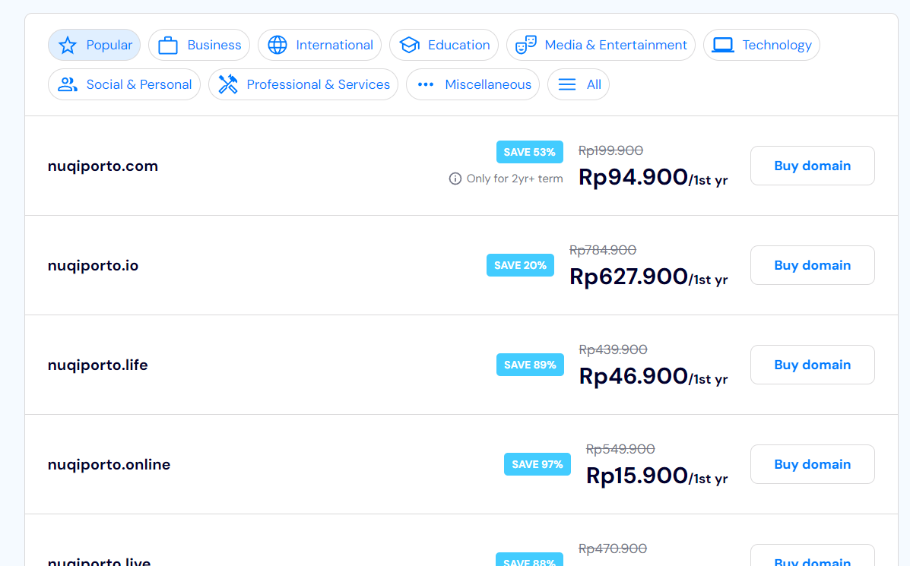

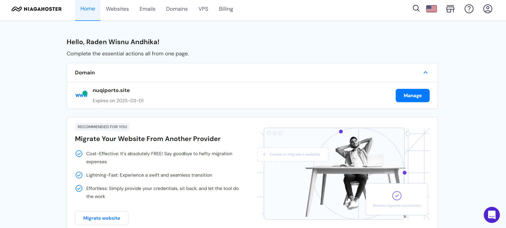

You can see your new domain in the home tab or domains

### 3. Set up custom domain in Netlify

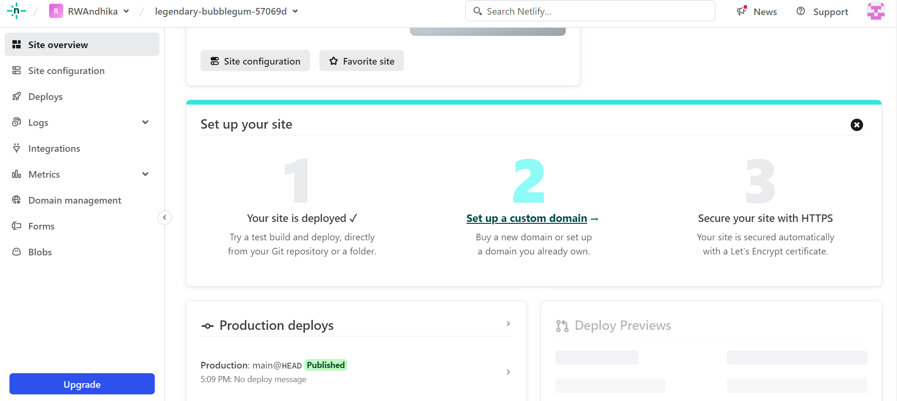

In netlify, click on __set up a custom domain__ in your deployed project

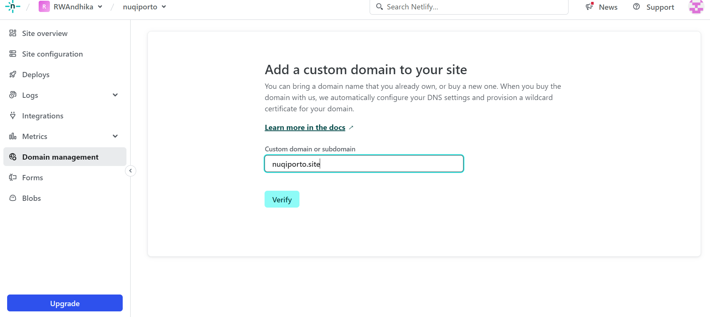

Set the name to the domain name that you had just buy and then click __verify__. Then choose __add domain__

### 4. Set up Netlify DNS for your Domain

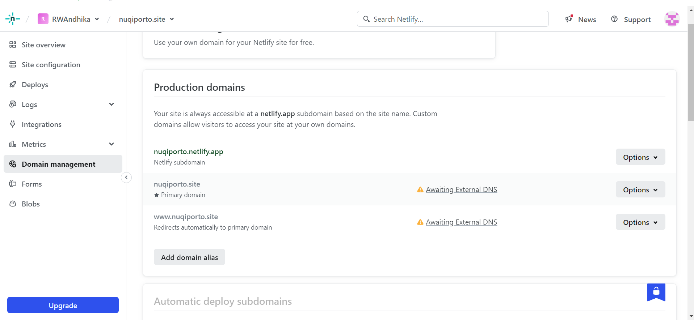

Choose __Option__ on the primary domain and the click on __Set up Netlify DNS__.

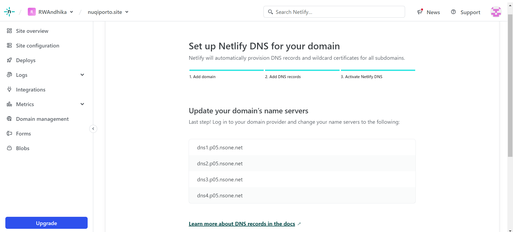

After that click verify, add domain, and then continue. You will get the domain's name servers for your domain provider that you need to change into the following names

### 5. Change domain name server to configure DNS

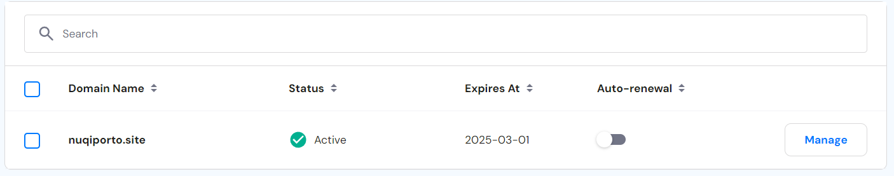

Go back to your domain provider in Niagahoster. On the Domains tab, click __Manage__ on your domain

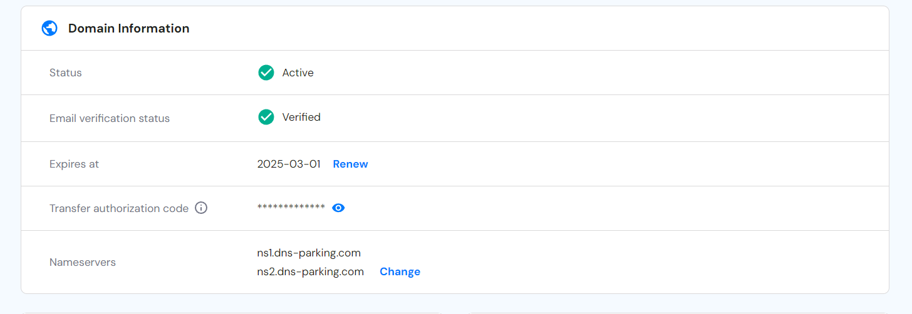

Go change the nameservers at domain information tab to the names that are given by netlify. Then, click __Save__

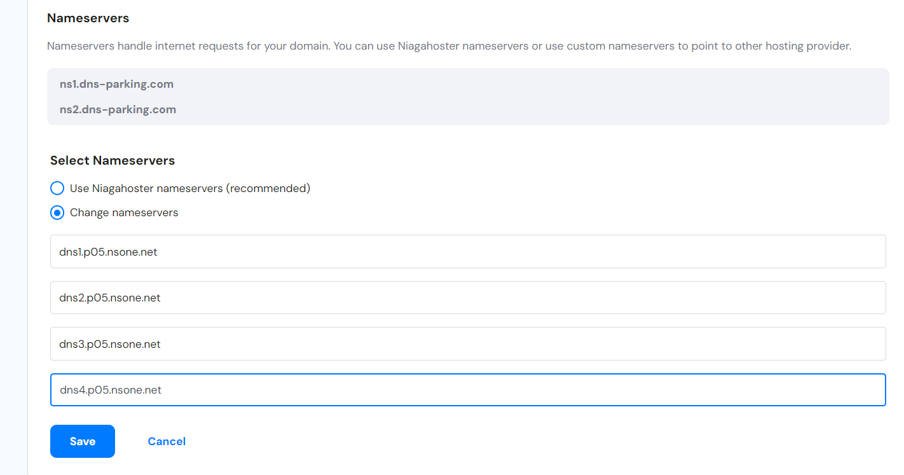

You can finally see the checkmark in Netlify once the DNS configuration is completed

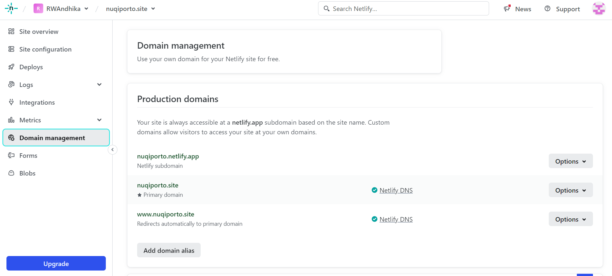

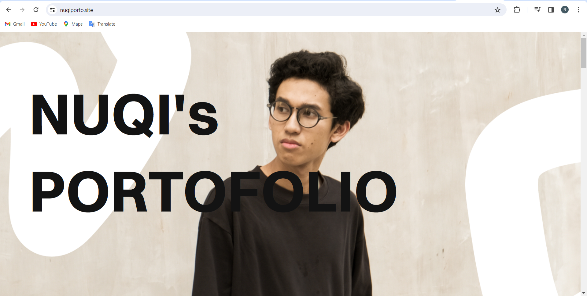

Raden Wisnu Andhika Pranidhia - Team 4

